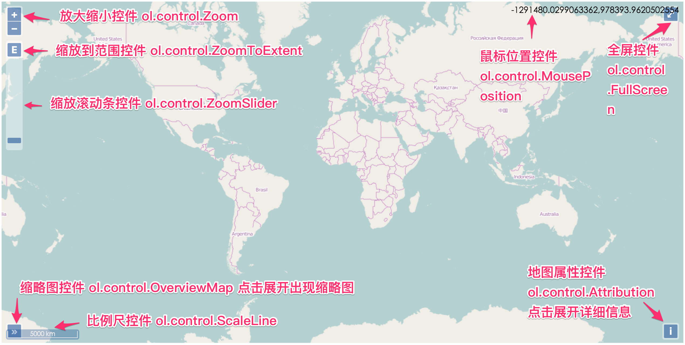

# Vue 3 + Vite
# 记录openlayers使用
初始化项目
### 下载
```node 
npm i ol -S
```
### 引入
在需要的组件中按需引入   

---------------
## **二、地图组成部分**
### 1、地图(Map)
> 一个空壳子，把所有元素组织在一起。   

### 2、视图(View)
> 控制地图显示的中心位置，范围，层级等

### 3、图层(Layer)
> 每一种图层在实现上都对应于一个类，放在包ol.layer下面

### 4、数据源(Source)
> 图层和数据源是密不可分的，多种不同的数据源，每一种在实现上也对应于一个具体的类，它们都放在包 ol.source 下面;目前 ol3，已支持多种多样在线或离线的数据源；可以是静态图或者瓦片图；也可以是栅格化的或者矢量的。

### 5、控件(Control)
> 它为用户提供了和地图交互的入口，其实现类都放在包ol.control下面

### 6、交互(Interaction)
> 其实现类放在包ol.interaction下面

---------------
## **三、坐标系**
目前OpenLayers 3支持两种投影，一个是EPSG:4326，等同于WGS84坐标系（全球通用），另一个是EPSG:3857，由Mercator投影而来（web地图专用），需要注意OpenLayers 3默认使用的是EPSG:3857

---------------
## **四、瓦片地图**

- ol.source.Tile
  对应的是瓦片数据源，现在网页地图服务中，绝大多数都是使用的瓦片地图，而OpenLayers 3作为一个WebGIS引擎，理所当然应该支持瓦片。
- ol.source.Image
  对应的是一整张图，而不像瓦片那样很多张图，从而无需切片，也可以加载一些地图，适用于一些小场景地图。
- ol.source.Vector
  对应的是矢量地图源，点，线，面等等常用的地图元素(Feature)，就囊括到这里面了。

经分析可知，OpenLayers 3的瓦片坐标系的原点在左上角，向上为y轴正方向，向右为x轴正方向。具体到地图上来讲，地球经过投影，投影到一个平面上，平面最左边对应地球最西边，平面最上边对应地球最北边。原点就处于整个平面的左上角，即地球的西北角，从北向南为y轴负方向，从西向东为x轴正方向。理解这一点非常重要，因为并不是所有在线的瓦片地图都是采用这样的坐标系。

在不同的细节层次下，自然分辨率就可能不一样，这两者是紧密结合在一起的。 对于图形显示系统而言，**分辨率作为屏幕坐标和世界坐标之间计算的纽带，其作用是非常重要的。**

---------------
## **五、图标及提示信息**
- 传统的overlay方法
  该方法的是用html方式显示图片，元素太多时，性能会严重受到影响。
- Feature + Style的方式
  
### 提示信息创建步骤：   

1、写好html布局，并设置好其对应的css样式
```javascript
<div id="popup" class="ol-popup">
    <a href="#" id="popup-closer" class="ol-popup-closer"></a>
    <div id="popup-content"></div>
</div>
```
2、创建overlay，并绑定html元素
```javascript
import Overlay from 'ol/Overlay.js';
import * as olProj from 'ol/proj';
import {toStringHDMS} from 'ol/coordinate.js';
let container = document.getElementById('popup');
let content = document.getElementById('popup-content');
let overlay = new Overlay({
    element: container,
    autoPan: true,
    autoPanAnimation: {
        duration: 250
    }
});
```
3、监听地图点击事件
```javascript
map.on('singleclick', function(evt) {
    var coordinate = evt.coordinate;
    var hdms = toStringHDMS(olProj.transform(
        coordinate, 'EPSG:4326''EPSG:3857'));
    content.innerHTML = '<p>You clicked here:</p><code>' + hdms +
        '</code>';
    overlay.setPosition(coordinate);
    map.addOverlay(overlay);
});
```
---------------
## **六、标绘**
有封装的现成的类 ol.interaction.Draw
---------------
## **七、控件**

OpenLayers 3目前内置的地图控件类都在包ol.control下面，依次有：
- ol.control.Attribution: 右下角的地图信息控件
- ol.control.FullScreen: 全屏控件
- ol.control.MousePosition: 鼠标位置控件
- ol.control.OverviewMap: 鸟瞰图控件
- ol.control.Rotate: 指北针控件
- ol.control.ScaleLine: 比例尺控件
- ol.control.Zoom: 缩放按钮控件
- ol.control.ZoomSlider: 缩放滚动条控件
- ol.control.ZoomToExtent: 放大到设定区域控件
### 参考文章 http://linwei.xyz/ol3-primer/